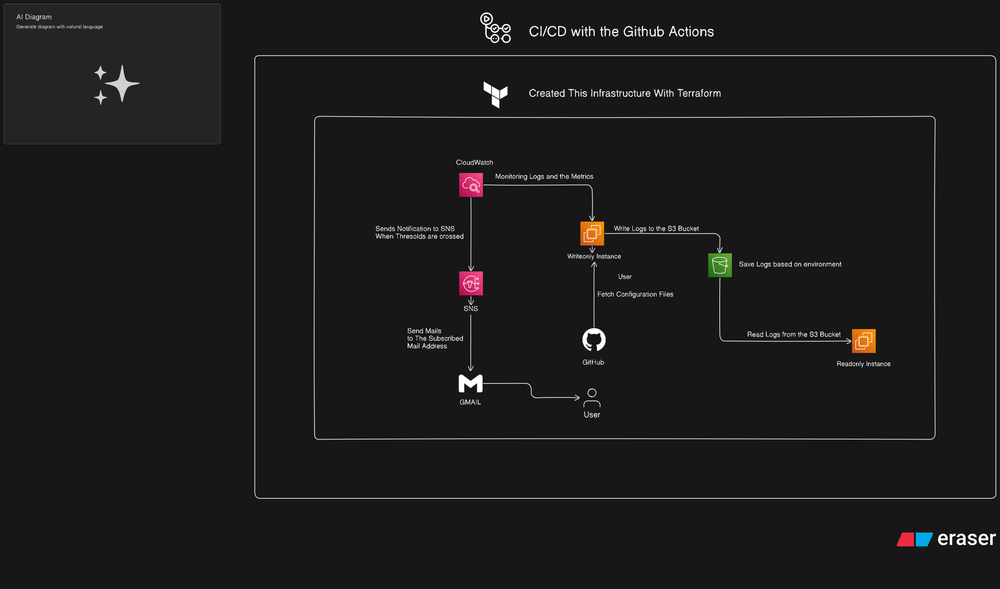

# 📘 DevOps EC2 Automation with Terraform & CloudWatch Monitoring (GitHub Actions Enabled)

This project provides a fully automated infrastructure deployment pipeline using **Terraform** and **GitHub Actions**. It provisions AWS EC2 instances, configures IAM roles, uploads logs to S3, fetches environment-based config files, ensures application health using port checks, and includes **real-time CloudWatch monitoring with automated error alerting**.

---

# Architecture




## 📁 Project Structure

```
.
├── backend/
│   └── techeazy-devops-0.0.1-SNAPSHOT.jar     # Spring Boot JAR
├── config/
│   ├── application-dev.yml                   # Dev application config
│   ├── application-prod.yml                  # Prod application config
│   └── cloudwatch-agent-config.json          # CloudWatch Agent configuration
├── scripts/
│   ├── upload_user_data.sh.tpl               # Write-only bootstrap with CloudWatch
│   └── download_user_data.sh.tpl             # Read-only bootstrap
├── terraform/
│   ├── backend-dev.config                    # Dev backend config for state
│   ├── backend-prod.config                   # Prod backend config for state
│   ├── deploy.sh                             # Bash deploy script
│   ├── dev_config.tfvars                     # Dev config variables
│   ├── prod_config.tfvars                    # Prod config variables
│   ├── main.tf                               # Resources definition
│   ├── cloudwatch.tf                         # CloudWatch monitoring resources
│   ├── outputs.tf                            # Outputs
│   └── variables.tf                          # Variable definitions
├── .github/
│   └── workflows/
│       └── terraform-lifecycle.yml           # GitHub Actions workflow
├── .gitignore
└── README.md
```

---

## 🔧 Key Features

- 🌍 **Multi-Environment Deployments**: Dev & Prod support
- 🔐 **Secure SSH Key Generation**
- ☁️ **S3 Logging with Stage-Specific Folder Paths**
- 🛠️ **Config Separation per Stage** (`application-dev.yml`, `application-prod.yml`)
- 🌐 **Fetch Runtime Configs from GitHub (Public/Private)**
- 🔑 **GitHub Token Handling for Private Repos**
- 📡 **EC2 Health Checks via GitHub Actions**
- 🛡️ **IAM Role-Based Access Control**
- 🕒 **Auto Shutdown After 10 Minutes**
- 🖥️ **Live SSH Log Monitoring via CI**
- 📊 **Real-time CloudWatch Monitoring with Automated Error Detection**
- 🚨 **Instant Email Alerts for Application Errors**
- 📈 **CloudWatch Agent Integration for Enhanced Logging**

---

## 🚨 New CloudWatch Monitoring Features

### Automated Error Detection & Alerting

- **CloudWatch Agent**: Automatically installed and configured on EC2 instances
- **Real-time Log Monitoring**: Monitors `/home/ubuntu/script.log` for error patterns
- **Intelligent Error Detection**: Triggers on keywords: `ERROR`, `Exception`, `FATAL`, `error`, `exception`
- **Instant Notifications**: SNS-based email alerts within 1 minute of error detection
- **Critical Alarm**: Activates immediately when any error is detected (1 datapoint threshold)

### SNS Topic & Email Notifications

- **Topic Name**: `script-error-alerts-{stage}` (e.g., `script-error-alerts-Dev`)
- **Email Subscription**: Configured via Terraform with your specified email
- **Confirmation Required**: You must confirm email subscription after `terraform apply`
- **Rich Alert Content**: Includes environment details, troubleshooting steps, and direct links

### CloudWatch Resources Created

| Resource             | Purpose                         | Configuration                                |
| -------------------- | ------------------------------- | -------------------------------------------- |
| **Log Group**        | `/aws/ec2/script-logs`          | 7-day retention                              |
| **Metric Filter**    | Error pattern detection         | `?ERROR ?Exception ?FATAL ?error ?exception` |
| **SNS Topic**        | `script-error-alerts-{stage}`   | Email notifications                          |
| **CloudWatch Alarm** | `CRITICAL-SCRIPT-ERROR-{stage}` | 1-minute evaluation period                   |

---

## 🚀 GitHub Actions CI/CD

### Workflow Trigger

- Manual via `workflow_dispatch`
- Auto-deploy on push to `main` with tags:
  - `deploy-dev`
  - `deploy-prod`

### Enhanced Workflow Behavior

1. Detects stage (`Dev`/`Prod`) and action (`apply`/`destroy`) using inputs or tag
2. Loads respective `.tfvars` and backend config
3. Initializes and validates Terraform with correct workspace
4. Applies or destroys infrastructure **including CloudWatch monitoring**
5. Downloads the correct stage config (`application-dev.yml` or `application-prod.yml`) from a private GitHub repo
6. Downloads and applies `cloudwatch-agent-config.json` for log monitoring
7. Provisions EC2 with config passed in and CloudWatch Agent pre-configured
8. SSH into the EC2 using Terraform-generated key
9. Executes `tail -f /home/ubuntu/script.log` and exits gracefully
10. Pushes logs to:
    - `s3://<bucket>/logs/dev/...`
    - `s3://<bucket>/logs/prod/...`
11. **Sets up real-time CloudWatch monitoring and error alerting**
12. Performs port 80 health check with up to 5 minutes retry

---

## 🧰 Prerequisites

- [Terraform CLI](https://developer.hashicorp.com/terraform/downloads)
- AWS CLI with configured profile
- GitHub Secrets:
  - `AWS_ACCESS_KEY`, `AWS_SECRET_ACCESS_KEY`, `AWS_REGION`
  - `GH_PAT` (GitHub Personal Access Token for private repos)
- **Valid Email Address** for CloudWatch alerts

```bash
export AWS_SHARED_CREDENTIALS_FILE="/path/to/credentials"
export AWS_PROFILE="your_profile"
```

- S3 bucket for Terraform state (Dev/Prod):

```bash
aws s3api create-bucket \
  --bucket dev-terraform-state-bucket-3084 \
  --region ap-south-1 \
  --create-bucket-configuration LocationConstraint=ap-south-1
```

---

## 🔐 Enhanced IAM Roles

| Role        | Access Type | Scope    | Permissions                                                 |
| ----------- | ----------- | -------- | ----------------------------------------------------------- |
| `writeonly` | Write-only  | EC2      | `s3:PutObject` + **CloudWatch Logs** + **CloudWatch Agent** |
| `readonly`  | Read-only   | EC2/User | `s3:GetObject`, `ListBucket`                                |

### New CloudWatch Permissions (Write-Only Role)

- `logs:CreateLogGroup`, `logs:CreateLogStream`, `logs:PutLogEvents`
- `logs:DescribeLogStreams`, `logs:DescribeLogGroups`
- `ec2:DescribeVolumes`, `ec2:DescribeTags`
- `CloudWatchAgentServerPolicy` attachment

---

## 🧠 Enhanced EC2 Bootstrap Logic

**On Launch (Write-Only EC2):**

- Installs JDK, Maven, AWS CLI
- **Installs and configures CloudWatch Agent**
- Downloads CloudWatch Agent configuration from private GitHub repo
- Clones Spring Boot repo
- Downloads the config (`dev` or `prod`) from GitHub
- Places it under `config/` before running the app
- **Starts CloudWatch Agent for real-time log monitoring**
- Starts JAR with `nohup`
- **Simulates test errors to verify monitoring works**
- Adds shutdown logic:
  - Uploads `/home/ubuntu/script.log` to stage-based S3 folder
  - Shuts down after 10 mins

---

## 📤 Enhanced Log Retrieval & Monitoring

### Traditional S3 Access (Read-Only EC2)

```bash
aws configure --profile readonly
aws s3 ls s3://<bucket>/logs/dev/
aws s3 cp s3://<bucket>/logs/dev/script.log .
```

### Real-time CloudWatch Monitoring

```bash
# View live logs
aws logs tail /aws/ec2/script-logs --follow

# Check error metrics
aws cloudwatch get-metric-statistics \
  --namespace "ScriptLogs/Dev" \
  --metric-name "ErrorCount" \
  --start-time 2025-01-01T00:00:00Z \
  --end-time 2025-01-02T00:00:00Z \
  --period 300 \
  --statistics Sum
```

---

## 🚨 Error Detection & Response

### Automatic Error Detection

- **Pattern**: Detects `ERROR`, `Exception`, `FATAL`, `error`, `exception` in logs
- **Response Time**: ~1 minute from error occurrence to email notification
- **Coverage**: All application logs written to `/home/ubuntu/script.log`

### Email Alert Content

Each alert includes:

- ✅ **Environment Details** (stage, instance ID, log locations)
- ✅ **Immediate Action Steps** (SSH commands, log checking)
- ✅ **Troubleshooting Links** (S3 backup, CloudWatch console)
- ✅ **Severity Level** (CRITICAL for any error detection)

### Post-Alert Actions

1. **Check Email**: Confirm SNS subscription after first deployment
2. **SSH to Instance**: Use provided commands in alert email
3. **Investigate**: Review logs both locally and in CloudWatch
4. **Download S3 Backup**: Access uploaded logs for detailed analysis

---

## 🔐 GitHub Config Handling

- **Supports both public and private GitHub repos** for config files
- **New CloudWatch Config**: `cloudwatch-agent-config.json` fetched from private repo
- Stage determines the access method:
  - `Dev`: fetches from private repo using GitHub PAT
  - `Prod`: requires GitHub PAT from Secrets

---

## 🖥️ SSH Log Monitoring (CI/CD)

After provisioning:

1. Terraform outputs `.pem` file path
2. GitHub Actions uses SSH to connect
3. Monitors `/home/ubuntu/script.log`
4. **CloudWatch Agent simultaneously streams logs to CloudWatch**
5. Handles timeout exit (code 124) gracefully

---

## 📎 Terraform Lifecycle Usage

```bash
# From GitHub UI:
# Trigger manually with: stage = Dev/Prod, action = apply/destroy
# NOTE: Confirm email subscription after first apply!

# From terminal:
cd terraform/
./deploy.sh Dev

# Check CloudWatch resources after deployment:
aws logs describe-log-groups --log-group-name-prefix "/aws/ec2/script-logs"
aws sns list-topics | grep script-error-alerts
```

---

## 🧪 Health Check Logic

- GitHub Actions retrieves EC2 public IP
- Verifies port 80 using `nc` + `curl`
- Retries for up to 5 minutes with graceful fail
- **CloudWatch monitoring runs independently of health checks**

---

## 📧 Email Confirmation Required

⚠️ **CRITICAL STEP**: After running `terraform apply`, you **MUST**:

1. Check your email inbox (including spam/junk folder)
2. Look for AWS SNS confirmation email
3. Click "Confirm subscription" link
4. **Without confirmation, you won't receive error alerts!**

### Verify Email Setup

```bash
# Check SNS subscription status
aws sns list-subscriptions-by-topic --topic-arn <sns-topic-arn>

# Test alert manually (triggers test error)
aws logs put-log-events \
  --log-group-name "/aws/ec2/script-logs" \
  --log-stream-name "test-stream" \
  --log-events timestamp=$(date +%s000),message="ERROR: Test alert"
```

---

## 🔍 Monitoring & Troubleshooting

### CloudWatch Console Access

- **Log Group**: Search for `/aws/ec2/script-logs`
- **Alarms**: Look for `CRITICAL-SCRIPT-ERROR-{stage}`
- **Metrics**: Navigate to `ScriptLogs/{stage}` namespace

### Common Issues & Solutions

| Issue                        | Solution                                       |
| ---------------------------- | ---------------------------------------------- |
| No email alerts              | Confirm SNS subscription via email             |
| CloudWatch Agent not running | Check `/opt/aws/amazon-cloudwatch-agent/logs/` |
| Missing log streams          | Verify IAM permissions for CloudWatch Logs     |
| False positive alerts        | Review metric filter pattern in Terraform      |

---

## ✅ Tips

- **Always confirm email subscription** after first deployment
- Use `terraform destroy -var-file=prod_config.tfvars` to clean up
- Always set `.pem` permissions to `0400`
- Check `systemd` logs to verify shutdown upload succeeded
- **Monitor CloudWatch costs** - log retention is set to 7 days to minimize charges
- Test error detection by manually adding ERROR messages to logs

---

## 📊 Outputs

After successful deployment, Terraform provides:

- EC2 instance IPs and IDs
- S3 bucket name for log storage
- **CloudWatch Log Group name**
- **SNS Topic ARN for alerts**
- **CloudWatch Alarm name**
- Private key file location

---

## 🎯 Manual Testing Error Detection

To verify monitoring works:

1. SSH to the write-only instance
2. Add test errors: `echo "ERROR: Test message" >> /home/ubuntu/script.log`
3. Wait ~1 minute for CloudWatch alarm
4. Check email for alert notification

---
